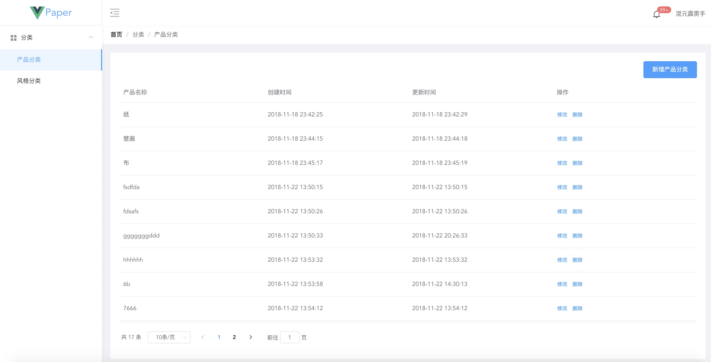
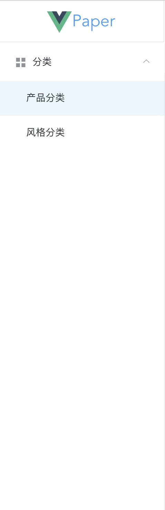
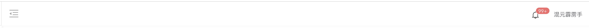
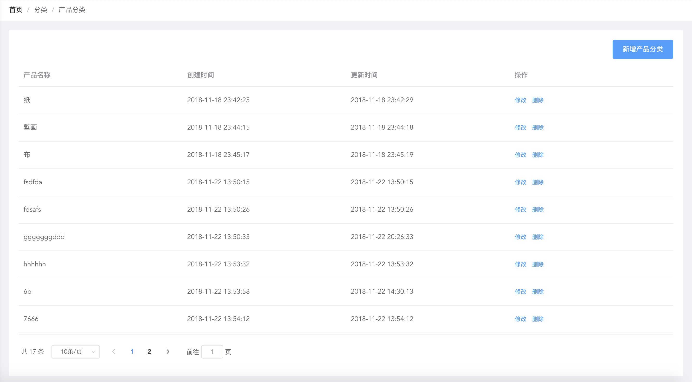

# 整体布局图布局

## 整体局图

## 页面布局方式

整个页面布局通过`element-ui`的layout组件进行布局。分别分为以下几点

## 左侧 aside 菜单选项

## 头布 header 头部布局

通过头部见左侧的图标可以对菜单选项进行收起，放大内容区域的部分

## 内容 main 内容布局

内部部分的顶部有着一个区域导航的提示，同样点击首页可以返回的首页。左侧菜单收起来,内部顶部导航就有着指示的作用。